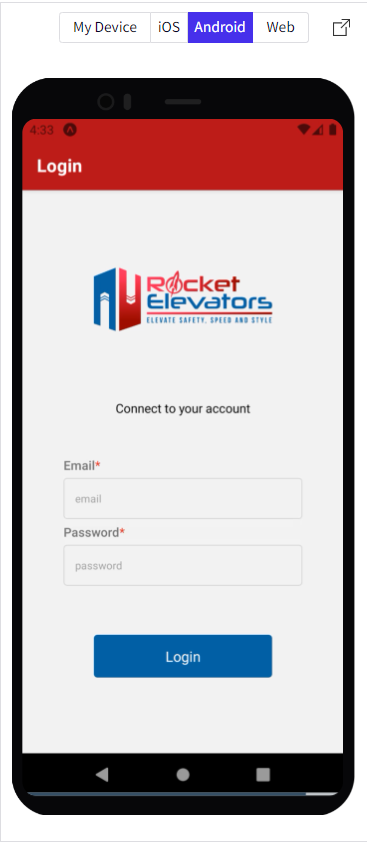
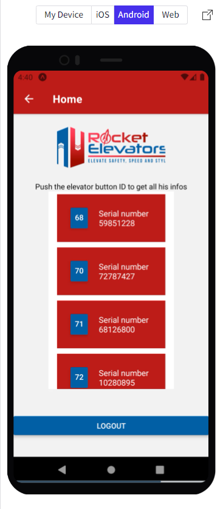
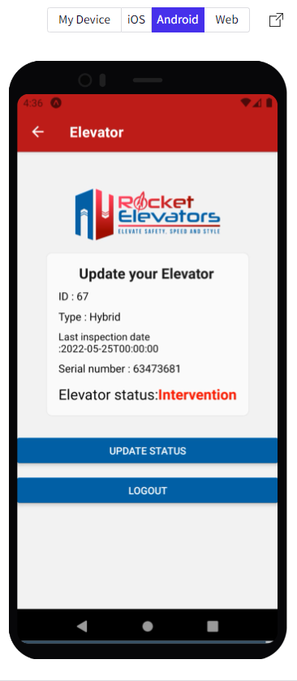
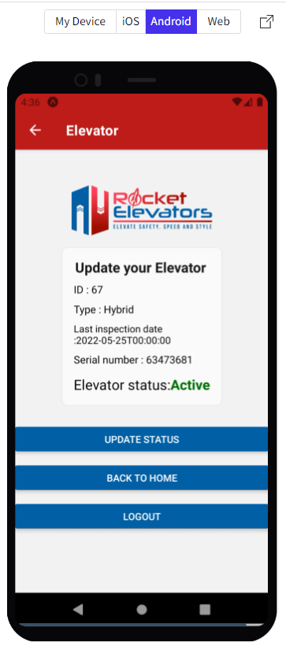

# Rocket-Elevators-Mobile-React-Native

For this week's project, I am presenting a React native mobile application for the employees of Rocket Elevator.

With this app, the employee is going to be able to access, after login in, the elevators' list that are not in operation, and change their status when the intervention is done.

Three pages are available, a login page, a home page and an elevator page.

To test the login page with an employee (no password needed for the moment):
| email: rudy@moen.net |

To test more conveniently the app on the Android button:
https://snack.expo.dev/@btbdev/rocket-elevator-mobile-mathieu

| Login |



| Home |



| Elevator status Intervention or Inactive |



| Elevator status Active |



Dependencies

# Expo

See all documentation about the installation here: https://docs.expo.dev/get-started/installation/

## Creating a project

If you're seeing this, you've probably already done this step. Congrats!

```bash
# create a new project in the current directory
npx create-expo-app my-app

# navigate to the project directory
cd my-app
```

## Developing

Once you've created a project and installed dependencies with `npm install` (or `pnpm install` or `yarn`), start a development server:

```bash
expo start
```
